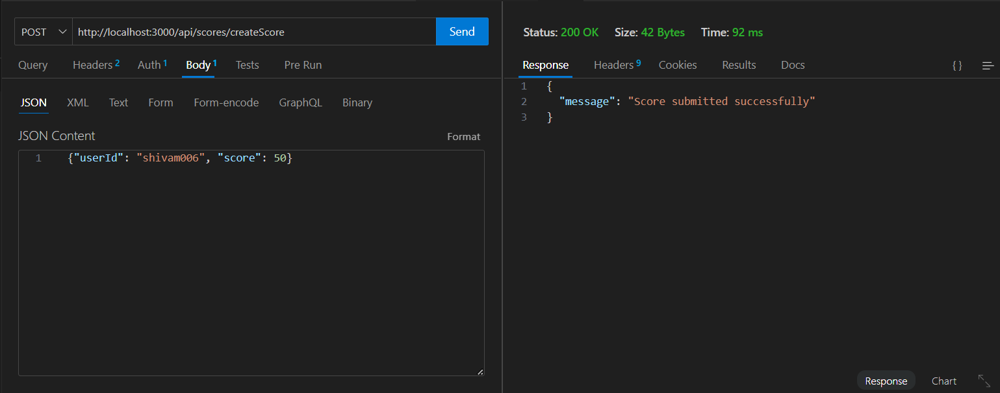
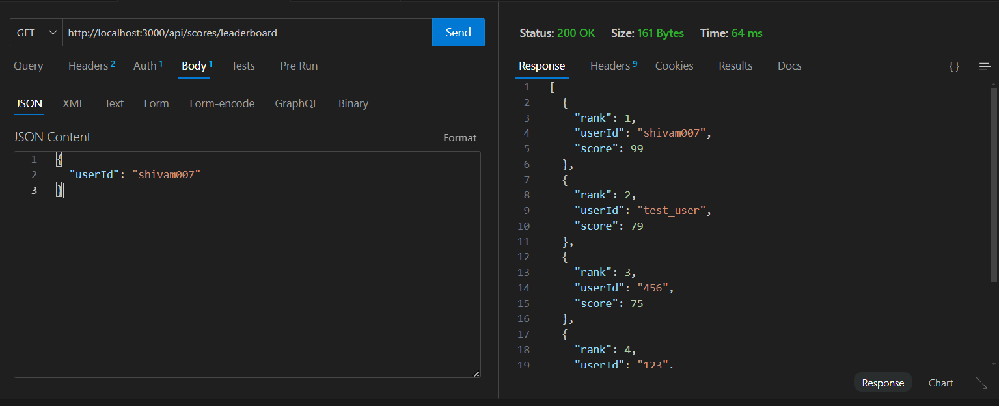
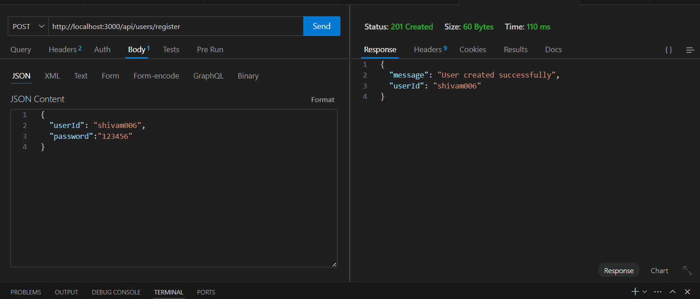
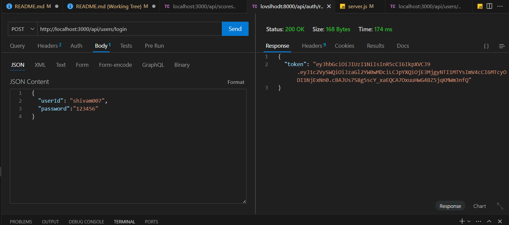

## api Usage note !! - use url - http://68.183.88.172:3000/

-/createScore

-/leaderboard

-/register

-/login no need for jwt in login api

# leaderboard

- Endpoints
  -- midlewares
  -- jwt validation
  -- score `post`
  -- schema creation - []
  -- routes entry addition - []
  -- error handling - []
  -- leaderboard `get`
  -- fetchAll sorte by scores

- DB
  -- mongodb
  -- instance creation - [link]()
  -- connection thru node - done

# Users

- Endpoints
  --midlewares
  --jwt validations
  --login
  -- authenticate and validate jwt
  --register
  --generate jwt
  -- add mongo entry for user
  -- user schema generation - []

  --

  # api scalability

  -- addition of rate limiter
  --redis cache impl
  --connection on local docker
  --setting data entry part
  --setting data expiration

  # Future Capabilities:-

  --Message Queue impl
  -we can use the abiity for message function for handeling the load on servers, preferable softwares kafka , redis-BullMQ and RabbitMQ
  --this will be a part of scallibility to reduce the load on server

  --Cluster
  --creating the cluster of node programs gives us the ability to create core of cpu in instance of you program, so that if 8 people send request to server it can be resolved by 8 differents node, instead of sending workload to single instance.

  --Logging
  --by using the logging system, we can track the performace of our application api and it will make the health check very easy.
  --Options we are haivng for loggings are ELK stack includes grifana, kibana,elastic beanstacks.

  --CDN
  --we can make use of CDN for recieving the data not available on our server except on some different server for accessing the data, Rather then storing every single details on server we can store data on different servers then access them via link

  --Replication
  --Replication is very important here for making the system fault tolerance, in case if any service goes down we can make the other up.

  --Deployment environment
  --we can also create 2 different environment for deployment 1- development 2 - production, this will give us one extra chance to verify if it is working fine in realtime.
